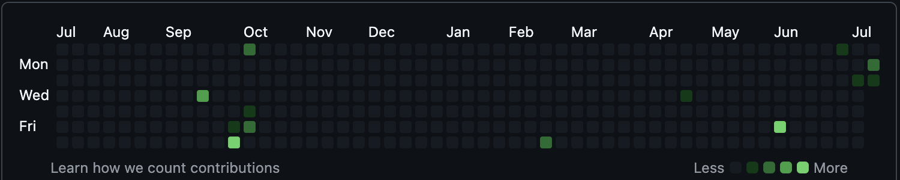

<h1 align="center">Hi there, I'm Samay 👋</h1>

  🌟 Machine Learning Engineer | 🧠 Accessibility Advocate | 💻 Software Engineer  
  <a href="https://www.linkedin.com/in/samay-bhojwani-032060260/">🔗 LinkedIn</a> • 
  <a href="mailto:sbhojwani2@unl.edu">📧 Email</a> • 
  <a href="https://lambent-souffle-fb184e.netlify.app/">🌐 Portfolio</a>

---

## 👨‍💻 About Me

I'm a Computer Science student at the University of Nebraska–Lincoln, passionate about building accessible, inclusive, and intelligent technologies. As a Break Through Tech AI Fellow at Cornell Tech and a UCARE-funded researcher, I focus on creating AI tools that bridge gaps in education—especially for neurodiverse learners.

Outside of class and research, I love building practical tools—from AI-powered summarizers to developer-focused productivity extensions—and exploring how tech can solve real-world challenges.

---

## 🔍 Areas of Interest
- 🤖 Natural Language Processing (NLP)
- 🧠 AI for Accessibility
- 🛠️ AI Product Design & Prototyping
- 🎯 Ethical + Human-Centered AI
- 🌐 Full-stack Development

---

## 📌 Featured Projects

### 🧠 [LexiSmart](https://github.com/your-username/lexismart-backend)
*AI-powered educational tool for dyslexia-friendly summarization and mind mapping*  
Built with GPT-4, React, Flask, and AWS Polly. Evaluates outputs using Flesch Reading Ease, ROUGE-L, and BERTScore to produce ultra-readable summaries. Incorporates real-time concept graph generation and voice command features.

> 📊 Key Features: Readability-optimized summaries, GPT-4o pipeline, semantic expansion, concept maps  
> 🧪 [View Project](https://lambent-souffle-fb184e.netlify.app/)

---

### 💬 [ExplainMate](https://github.com/Samay30/explainmate-backend)
*A VSCode extension that explains code in sync with voice narration using GPT and ElevenLabs.*  
Helps students and beginners understand code logic line-by-line with real-time voice + text highlighting.

> 🚀 Tech Stack: FastAPI, ElevenLabs TTS, VSCode API, JavaScript  
> 🔊 [Demo Video](#https://www.linkedin.com/feed/update/urn:li:activity:7337893195344674816/) | 🧩 [VSCode Extension](https://github.com/Samay30/explainmate-backend)

---

### 🔐 [TokenFlow](https://github.com/Samay30/TokenFlow)
*A command-line tool for testing and automating OAuth2/OpenID Connect login flows for security and IAM teams.*  
Supports integration with Secret Server and AWS for secure token validation.

> 🛠 Built with: Python, Requests, AWS SDK, Click  
> 💡 Used in production for IAM testing at UNL

---

## 📈 GitHub Stats

  

---

## 📂 AI Studio Project README Summary

For the Fall AI Studio, my main project is **LexiSmart**:

- ✅ **Overview**: Build a summarization pipeline optimized for dyslexic learners  
- 🎯 **Objectives**: Maximize Flesch Readability while preserving meaning  
- ⚙️ **Methodology**: GPT-4o + heuristic reranking using composite readability & BERTScore  
- 📊 **Results**: >90% readability compliance, outperforming baseline summarizers  
- 📈 **Visuals**: Pseudo-loss vs. readability charts included  
- 🧑‍💻 **My Role**: Prompt engineering, evaluation pipeline, Flask backend, UI/UX design  
- 🔜 **Next Steps**: Add user-controlled reading level input, optimize speed & cost

---

## 🔧 Tech Stack

Languages: Python, JavaScript, HTML/CSS
Frameworks: React.js, Flask, FastAPI, VSCode API
AI Tools: OpenAI (GPT-4o), BERTScore, AWS Polly
DevOps: GitHub Actions, Render, Netlify, Docker
Data Science: Pandas, NumPy, Matplotlib, SpaCy, Scikit-learn

---

## 🤝 Let’s Connect

- LinkedIn: [linkedin.com/in/samaybhojwani](https://www.linkedin.com/in/samay-bhojwani-032060260/)
- LexiSmart Deployment Link: [https://lambent-souffle-fb184e.netlify.app/](https://lambent-souffle-fb184e.netlify.app/)
- Email: [samaybhojwani.dev@gmail.com](mailto:sbhojwani2@unl.edu)

---

⭐ Don’t forget to check out my pinned repositories and follow for project updates!
